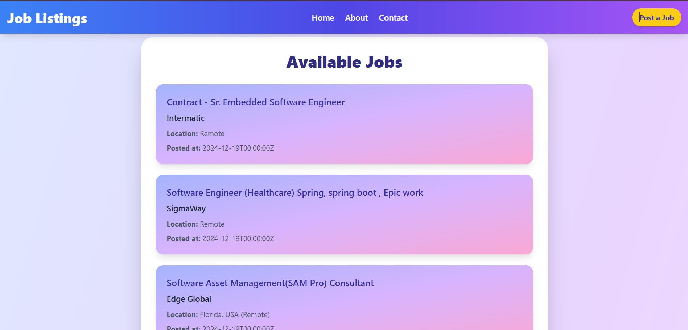
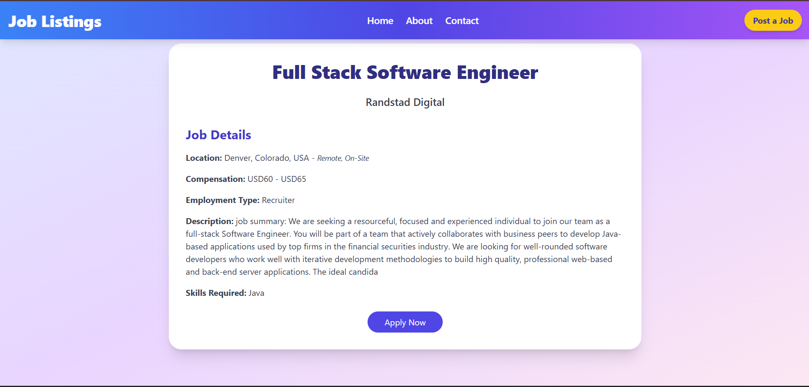
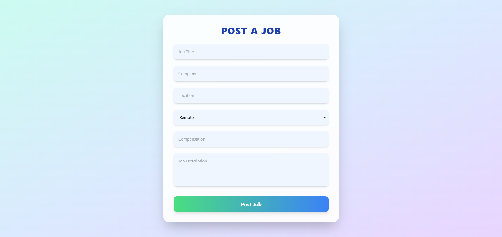

# Job Listing Website

This project is designed to manage and display job listings on a website. It consists of three main components:

1. **Backend**: A Django REST Framework API for managing job listings in a MySQL database.
2. **Scraper**: A Scrapy-based Python script that scrapes job data from Dice.com and stores it in the database via the backend API.
3. **Frontend**: A ReactJS application that displays the job listings in a responsive, user-friendly interface.


## Backend - Django REST Framework API

### Overview

The backend is built using **Django REST Framework** to manage job listings stored in a **MySQL** database. It provides two main endpoints:

- **GET /jobs/**: Retrieves all job listings from the database.
- **POST /jobs/**: Adds a new job listing to the database.

### Setup

1. **Install Dependencies**:
    Navigate to the `backend` directory and install the required Python dependencies:
    ```bash
    cd joblisting
    pip install -r requirements.txt
    ```

2. **Database Setup**:
    - Set up **MySQL** and create a database for the job listings.
    - Update the `DATABASES` setting in `joblisting/settings.py` with your MySQL credentials.
    - Example database configuration:
      ```python
      DATABASES = {
          'default': {
              'ENGINE': 'django.db.backends.mysql',
              'NAME': 'your_databasename',
              'USER': 'your_username',
              'PASSWORD': 'your_password',
              'HOST': 'localhost',
              'PORT': '3306',
          }
      }
      ```

3. **Migrations**:
    Apply migrations to set up the database schema:
    ```bash
    python manage.py migrate
    ```

4. **Start the Backend**:
    Run the Django development server:
    ```bash
    python manage.py runserver
    ```

    The backend will be available at `http://127.0.0.1:8000`.

## Scraper - Scrapy Script

### Overview

The scraper is a Python script using the **Scrapy** framework to scrape job data from **Dice.com**. The scraper retrieves job listings and sends them as POST requests to the Django backend API for storage.

### Setup

1. **Install Dependencies**:
    Navigate to the `scraper` directory and install the required Python dependencies:
    ```bash
    cd job_scraper
    pip install -r requirements.txt
    ```

2. **Scraping Script**:
    - The script retrieves job data from **Dice.com**, including relevant job information like job titles, company names, locations, salaries, and posting dates. The script also handles pagination to scrape all available job listings.
    - The scraper fetches job data, handling pagination by identifying and using the site's API calls. This ensures efficient and comprehensive data extraction.
   This script:
    - Fetches job data from Dice.com using the specified API endpoint.
    - Posts the scraped data to the backend API using a `POST` request.

4. **Run the Scraper**:
    Execute the scraper script to start scraping job data:
    ```bash
    scrapy crawl job_spider
    ```

    The data will be stored in the backend MySQL database.

## Frontend - ReactJS with Tailwind CSS

### Overview

The frontend is built using **ReactJS** for rendering the user interface. **Tailwind CSS** is used for styling the components, providing a responsive and modern design.

### Setup

1. **Install Dependencies**:
    Navigate to the `frontend` directory and install the required dependencies:
    ```bash
    cd job-listing-frontend
    npm install
    ```

2. **Start the Frontend**:
    Run the development server to start the frontend:
    ```bash
    npm start
    ```

    The frontend will be available at `http://localhost:3000`.

### Features

- **Job Listing Display**: The frontend makes a GET request to the backend API to fetch job listings and displays them in a responsive grid.
- **Job Details**: Each job listing shows the job title, company name, job location, salary, and posted date.
- **Responsive Design**: The interface adjusts based on screen size, ensuring a smooth user experience on both desktop and mobile devices.

### Screenshots

Below are screenshots of the job listing website showcasing various features:

1. **Main Page**: The homepage displaying the list of job postings.  
   

2. **Detail View**: A detailed view of a specific job listing.  
   

3. **Post Job**: The interface for posting a new job listing.  
   

## Prerequisites

- Python 3.8+
- Node.js (v14 or higher)
- MySQL (5.7 or higher)
- Django REST Framework
- Scrapy Framework

